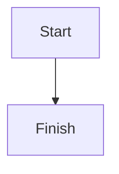

# Markdown Mermaid 图表渲染设计

## 背景

当前应用内已经存在多处 Markdown 渲染入口：

- `src/lib/components/MessageBlock.svelte`
- `src/lib/components/Reasoning.svelte`
- `src/lib/components/PlanCard.svelte`

它们都基于 `marked + DOMPurify` 渲染 Markdown，但目前仅支持普通文本、列表、代码块等基础元素，不支持 ` ```mermaid ` fenced code block 渲染为图表。

用户期望第一版支持 Mermaid 全家桶常见图型，并且在消息、推理块、计划卡片等所有 Markdown 入口中保持一致体验。

## 目标

- 让应用内现有 Markdown 渲染入口统一支持 ` ```mermaid ` 代码块
- 覆盖 Mermaid 常见图型：流程图、时序图、甘特图、状态图、类图、ER 图、journey 等
- Mermaid 渲染失败时优雅回退到原始代码块文本
- 保持现有 Markdown 行为和安全边界不退化

## 非目标

- 不支持任意“数据图表 DSL”或通用柱状图/折线图 Markdown 语法
- 不新增服务端预渲染或截图渲染
- 不支持用户在 Mermaid 源码中注入任意 HTML 扩展能力
- 不在第一版中处理导出 PNG/SVG、图表缩放面板、图表编辑器等增强功能

## 用户体验

### 支持范围

以下入口都应支持 Mermaid 图表渲染：

- 助手消息中的 Markdown
- 推理块中的 Markdown
- PlanCard 中的 Markdown

### 触发语法

第一版仅识别标准 fenced code block：

````md

````

普通代码块继续按当前行为渲染，不受影响。

### 失败回退

当 Mermaid 源码非法、初始化失败或运行时抛错时：

- 不让整个 Markdown 区块崩溃
- 回退显示为普通代码块
- 可选显示一个轻量错误提示，但不影响正文阅读

## 方案选择

### 采用方案

采用“共享 Markdown + Mermaid 渲染层”：

1. 保留当前 `marked + DOMPurify` 主链
2. 抽一个共享渲染模块统一处理 Mermaid fence
3. 由各组件复用该模块与增强逻辑，而不是在每个组件里复制 Mermaid 代码

### 不采用的方案

#### 方案 A：每个组件单独接 Mermaid

不采用原因：

- 逻辑复制严重
- 后续主题、错误处理、性能优化要维护多份

#### 方案 B：整体替换为 remark/rehype AST 渲染链

不采用原因：

- 这次需求只需要 Mermaid，不值得大规模替换现有 Markdown 主链
- 回归面和迁移风险过大

## 架构设计

### 新增共享渲染层

建议新增模块，例如：

- `src/lib/markdown/render-markdown.ts`
- `src/lib/markdown/mermaid-enhancer.ts`

职责分工：

#### `render-markdown.ts`

- 封装 `marked` 的统一配置
- 识别 ` ```mermaid ` fenced code block
- 对普通 Markdown 输出 HTML
- 对 Mermaid code block 输出受控占位节点，而不是直接输出 `<pre><code>`
- 对结果继续做 `DOMPurify.sanitize`

#### `mermaid-enhancer.ts`

- 在组件挂载后扫描 Mermaid 占位节点
- 调用 Mermaid API 将源码渲染成 SVG
- 捕获 Mermaid 渲染错误并执行回退
- 管理主题同步与重复渲染去重

### 占位节点协议

Markdown 渲染阶段，Mermaid fence 先输出为类似结构：

```html
<div class="md-mermaid" data-mermaid-source="...escaped source..."></div>
```

要求：

- 节点结构稳定，便于各组件统一增强
- Mermaid 源码通过受控方式写入，避免与普通 HTML 注入混淆
- 普通代码块仍保持现有 `<pre><code>` 输出

### 组件接入方式

以下组件统一复用共享层：

- `MessageBlock.svelte`
- `Reasoning.svelte`
- `PlanCard.svelte`

每个组件只负责：

- 调用统一的 Markdown 渲染函数拿到 HTML
- 在渲染容器上挂载 Mermaid enhancer

每个组件不再自己理解 Mermaid 语法。

## Mermaid 配置

### 初版配置原则

- 使用统一 Mermaid 初始化入口
- 安全配置保持保守
- 跟随现有应用主题映射 Mermaid 浅色/深色主题

### 主题策略

Mermaid 主题不做每条消息自定义，统一根据当前 UI 主题选择：

- Light theme -> Mermaid light / neutral 风格
- Dark theme -> Mermaid dark 风格

如果后续需要更细的品牌色适配，可在第二版补充 Mermaid themeVariables。

## 安全设计

### 保持 DOMPurify 主链

现有 Markdown 渲染后的 HTML 仍需通过 `DOMPurify.sanitize`。

### Mermaid 安全边界

- Mermaid 源码只来自 Markdown fence 文本
- 不开放任意 HTML 注入能力
- 渲染输出由 Mermaid 生成 SVG，再由前端受控插入到占位节点

### 渲染失败隔离

任意一张图表渲染失败：

- 只影响该图表节点
- 不影响同一条消息中的其他 Markdown 内容
- 不影响整个页面渲染

## 性能考虑

### 按需渲染

- 仅对包含 Mermaid 占位节点的容器执行增强
- 不对普通 Markdown 容器做额外 Mermaid 初始化

### 重复渲染控制

- 同一容器在内容未变化时避免重复渲染
- 组件更新时只处理新的 Mermaid 占位节点

### 大文本回退兼容

现有超长 Markdown 文本的 plain text 回退逻辑应保持不变。
如果文本长度已经超过当前 Markdown 渲染上限，则不强行渲染 Mermaid。

## 测试策略

### 单元测试

新增/补充测试覆盖：

- 普通 fenced code block 不受影响
- ` ```mermaid ` 会被识别成 Mermaid 占位节点
- 非法 Mermaid 源码会进入回退路径
- 主题切换时 Mermaid 配置选择正确

### 组件测试

覆盖以下入口一致性：

- `MessageBlock`
- `Reasoning`
- `PlanCard`

断言点：

- Mermaid fence 在三个入口都能触发图表增强
- 普通 Markdown 与普通代码块不退化
- 渲染失败时能看到回退内容

### 回归测试

- 现有 Markdown 样式与代码块样式保持可读
- 不引入新的 XSS 风险回归
- 不影响现有 DOMPurify/marked 使用路径

## 风险与缓解

### 风险 1：Mermaid 与 DOMPurify/innerHTML 链路冲突

缓解：

- 明确分离“Markdown sanitize 输出”和“Mermaid SVG 注入”两个阶段
- 通过受控 enhancer 注入，不在 Markdown parser 阶段直接拼 SVG

### 风险 2：多个组件重复实现导致行为不一致

缓解：

- 统一抽共享模块
- 组件层仅做接线

### 风险 3：图表渲染造成长消息卡顿

缓解：

- 仅对 Mermaid 占位节点按需渲染
- 首版不做过度动画和复杂交互
- 后续若有性能问题，再补懒加载或可见区渲染

## 实施顺序

1. 抽共享 Markdown 渲染模块
2. 在共享层中识别 Mermaid fenced code block
3. 新增 Mermaid enhancer/action
4. 接入 `MessageBlock`
5. 接入 `Reasoning`
6. 接入 `PlanCard`
7. 补单测与组件测试
8. 做主题与失败回退回归

## 验收标准

- 助手消息中的 ` ```mermaid ` 能渲染为 Mermaid 图表
- 推理块中的 ` ```mermaid ` 能渲染为 Mermaid 图表
- PlanCard 中的 ` ```mermaid ` 能渲染为 Mermaid 图表
- Mermaid 渲染失败时会优雅回退成原始代码块
- 普通 Markdown 与普通代码块行为不变
- 安全策略不退化
