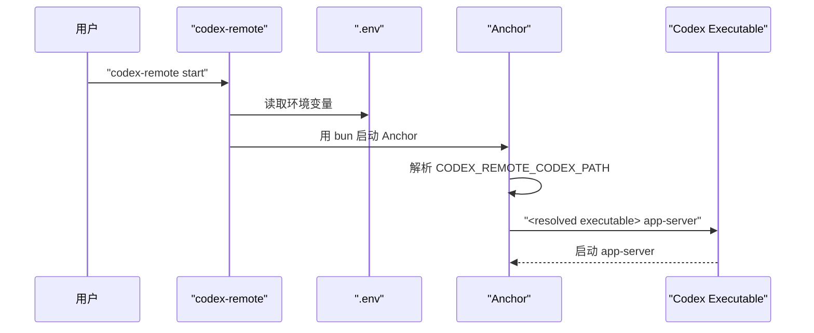
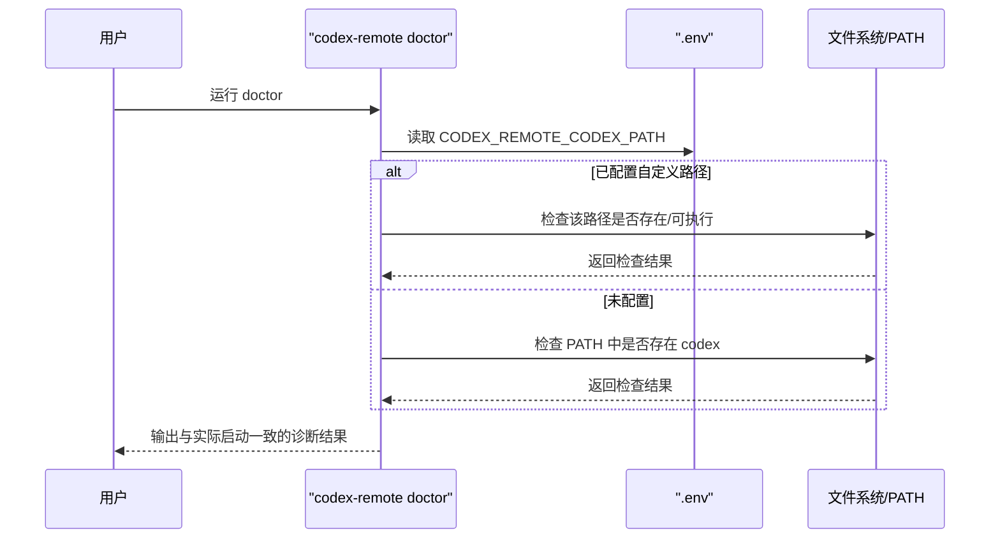

# 自定义 Codex 可执行文件路径设计

## 背景

当前 Anchor 启动 `codex app-server` 的入口位于 `services/anchor/src/index.ts`，实际调用是硬编码的：

```ts
cmd: ["codex", "app-server"]
```

这意味着当前行为完全依赖 PATH 中存在 `codex` 命令。

对于存在多个 Codex 安装、非标准安装位置、便携版安装或希望固定绑定某个可执行文件版本的用户，这种方式不够灵活。

用户本轮需求已经明确收敛为：

- 只支持指定“单个可执行文件路径”
- 配置入口只放在 `.env`
- 不增加 Settings 页面 UI
- 不支持整条命令或额外参数

## 目标

- 支持通过 `.env` 指定 Codex 可执行文件路径
- Anchor 启动 `app-server` 时优先使用该路径
- 未配置时保持当前默认行为，继续使用 `codex`
- `doctor` 检查与实际启动逻辑一致，避免“能启动但 doctor 报错”或“doctor 通过但启动失败”

## 非目标

- 不支持命令模板、shell 片段或额外参数
- 不支持在 Settings 页面查看或编辑该值
- 不改动 Orbit、认证协议或控制面行为
- 不在本次任务中处理多可执行文件候选自动探测

## 用户体验

### 配置方式

用户在 `.env` 中新增可选配置：

```env
CODEX_REMOTE_CODEX_PATH=
```

示例：

```env
CODEX_REMOTE_CODEX_PATH=C:\Users\name\scoop\apps\codex\current\codex.exe
```

或：

```env
CODEX_REMOTE_CODEX_PATH=/opt/codex/bin/codex
```

### 行为规则

- 当 `CODEX_REMOTE_CODEX_PATH` 为空时：
  - Anchor 继续使用 `codex app-server`
- 当 `CODEX_REMOTE_CODEX_PATH` 非空时：
  - Anchor 使用 `<配置路径> app-server`
- 当路径无效或不可执行时：
  - Anchor 启动失败并输出明确错误
  - `doctor` 应给出同样口径的检查结果

## 方案选择

### 采用方案

采用“`.env` 单路径覆盖 + 启动/自检共用解析规则”。

实现原则：

1. 只增加一个环境变量 `CODEX_REMOTE_CODEX_PATH`
2. Anchor 与 CLI `doctor` 统一读取同一个配置来源
3. 未配置时完全保留当前默认行为

### 不采用方案

#### 方案 A：支持整条命令或参数数组

不采用原因：

- 用户明确只要单个可执行文件路径
- 命令拆分、转义、跨平台 quoting 会显著增加复杂度
- 容易引入不必要的 shell 行为差异

#### 方案 B：在 Settings 页面增加 UI

不采用原因：

- 用户明确希望只通过 `.env` 配置
- 现阶段增加 UI 会引入额外 RPC、文案和状态同步成本

#### 方案 C：把可执行文件路径写入 Codex 自身 `config.toml`

不采用原因：

- 这会把仓库需求扩展到另一套配置体系
- 与用户本轮明确的 `.env` 入口不一致

## 架构设计

### 1. 配置层

在 Anchor 进程中新增一个解析后的变量，例如：

- `CODEX_EXECUTABLE = process.env.CODEX_REMOTE_CODEX_PATH?.trim() || "codex"`

要求：

- 仅做字符串级 trim
- 空字符串视为未配置
- 不在这里做 shell 解析

### 2. 启动层

当前硬编码：

- `["codex", "app-server"]`

目标改为：

- `["<resolved executable>", "app-server"]`

这样能保持 `Bun.spawn` 的参数模型不变，只替换第一个 argv。

### 3. 自检层

`bin/codex-remote` 与 `bin/codex-remote.ps1` 当前都直接检查 PATH 中是否存在 `codex`。

目标改为：

- 如果 `.env` 中配置了 `CODEX_REMOTE_CODEX_PATH`
  - 检查该路径是否存在
  - 检查该路径是否可执行
  - 输出检查结果时明确展示使用的是自定义路径
- 如果未配置
  - 保持当前 `codex` 命令检查逻辑

这能让 `doctor` 与 Anchor 的实际启动来源保持一致。

## 关键组件

### Anchor

- `services/anchor/src/index.ts`
  - 负责读取环境变量
  - 负责用解析后的可执行文件启动 `app-server`

### Shell CLI

- `bin/codex-remote`
  - 负责在 Unix-like 环境中加载 `.env`
  - 负责 `doctor` 的自定义路径检查逻辑

### PowerShell CLI

- `bin/codex-remote.ps1`
  - 负责在 Windows 环境中加载 `.env`
  - 负责 `doctor` 的自定义路径检查逻辑

### 示例配置

- `.env.example`
  - 增加 `CODEX_REMOTE_CODEX_PATH=`
  - 作为可选项说明用途

## 数据流

### 启动流程



### Doctor 流程



## 错误处理

### 自定义路径为空

- 视为未配置
- 回退到默认 `codex`

### 自定义路径不存在

- Anchor 启动时报错，明确指出配置路径
- `doctor` 报错时同样展示该路径

### 自定义路径存在但无法执行

- Anchor 启动时报错
- `doctor` 给出不可执行的失败提示

### 自定义路径包含空格

- 由于使用 `Bun.spawn` 的 argv 数组形式，只要把整个路径作为一个 argv 传入即可，不需要额外 shell quoting

## 测试策略

### 单元测试

建议补充：

- Anchor 对未配置值时回退到 `codex`
- Anchor 对配置值时使用自定义路径
- 配置值带前后空白时能正确 trim

### CLI 行为测试

建议补充：

- Unix shell `doctor` 在配置/未配置两种模式下输出不同检查逻辑
- PowerShell `doctor` 在配置/未配置两种模式下输出不同检查逻辑

### 回归验证

至少确认：

- 未配置 `CODEX_REMOTE_CODEX_PATH` 时，现有安装和启动方式不变
- 已配置时，Anchor 确实调用指定路径，而不是 PATH 中的 `codex`

## 实施顺序

1. 在 `.env.example` 与默认 `.env` 模板中增加 `CODEX_REMOTE_CODEX_PATH`
2. 修改 Anchor 的 `app-server` 启动入口，支持使用自定义路径
3. 修改 Unix shell CLI 的 `doctor` 检查逻辑
4. 修改 PowerShell CLI 的 `doctor` 检查逻辑
5. 补充测试与 README/Anchor 文档说明

## 验收标准映射

- 用户可以显式配置一个自定义 Codex 可执行文件
  - 通过 `.env` 中的 `CODEX_REMOTE_CODEX_PATH` 实现
- 未配置时保持现有默认行为不回归
  - 默认仍使用 `codex app-server`
- 配置无效时有可理解的报错或回退策略
  - 空值回退默认
  - 无效路径在 Anchor 与 `doctor` 中都给出明确错误
